# DOS Tech Drive Hands-On Guide

## Presenters

Presenters: `Leh Hoon Lim`
`Gladys Lim`
`Jian Bo Cai`
`Jing Kiat`
`Maka Sitaram`

This hands-on guide shows how to build an AI assistant that can use tools, read from a Knowledge Base, analyze structured data, and combine public context with data-driven answers.

The hands-on uses a Singapore housing and cost-of-living storyline so the agent behavior can be tested against realistic questions. The goal is to understand how Dify agents decide when to use Knowledge Base, when to call tools, and when to fall back to web research.

Please note this is just experimental the answers generated by AI are not accurate or final

## Agenda

Session flow:

1. Setup
   - Sign in to Dify.
   - Prepare E2B for Python sandbox execution.
   - Add the E2B API key to Dify.
   - Prepare Firecrawl for web scraping.
   - Add the Firecrawl API key to Dify.
   - Add Bedrock model credentials to Dify.

2. Knowledge Base / RAG
   - Create a Dify Knowledge Base.
   - Add workshop and public-context material.
   - Understand when the agent should use RAG and when it should use tools.

3. Tool Building
   - Build or import a Data Analyst tool.
   - Build or import a Researcher / Web Scraper tool.
   - Validate each tool independently before attaching it to an agent.

4. Agent Building
   - Create a master agent.
   - Attach the Knowledge Base.
   - Add Data Analyst, Researcher, and other tools.
   - Tune the agent instructions so it can route tasks properly.

7. Demo Scenario
   - Ask housing and cost-of-living questions.
   - Let the agent decide when to use Knowledge Base, Data Analyst, and Researcher.
   - Review tool calls, answers, limitations, and fallback behavior.

8. Wrap-Up
   - Review what worked.
   - Review what failed.
   - Understand how tool descriptions and agent instructions affect behavior.
   - Close with next steps for production use.

## Setup

Complete this setup before building tools or agents. Most workflow failures later come from missing keys or incorrect model configuration.

### 1. Dify Account

Dify is the main platform for this hands-on.

Open Dify:

`https://cloud.dify.ai`

What you need to do:

1. Go to `https://cloud.dify.ai`.
2. Sign in or create an account.
3. Create or select your workspace.
4. Confirm that you can access:
   - Studio
   - Knowledge
   - Tools
   - Plugins
   - Model Provider settings

Screenshot:

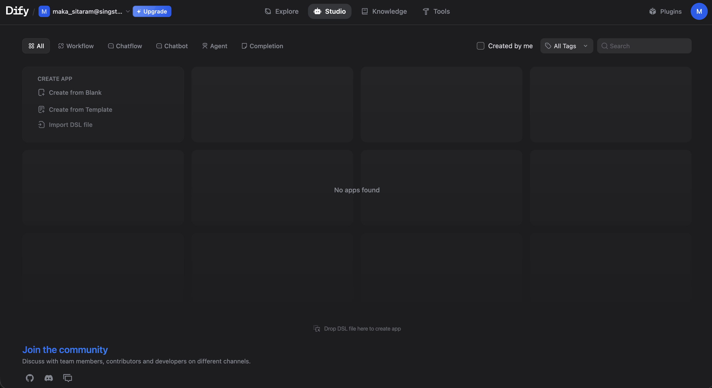

### 2. E2B Account

E2B is used to run Python code inside a sandbox.

Open E2B:

`https://e2b.dev`

E2B dashboard:

`https://e2b.dev/dashboard`

Why we need it:

Our Data Analyst workflow uses E2B to run Python, pandas, charts, LazyPredict, and FLAML. Without E2B, the analysis tool cannot create a sandbox or run code.

What you need to do:

1. Go to `https://e2b.dev`.
2. Sign in or create an account.
3. Open the dashboard at `https://e2b.dev/dashboard`.
4. Create or copy your API key.
5. Keep the key ready for the Dify configuration step.

Screenshots:

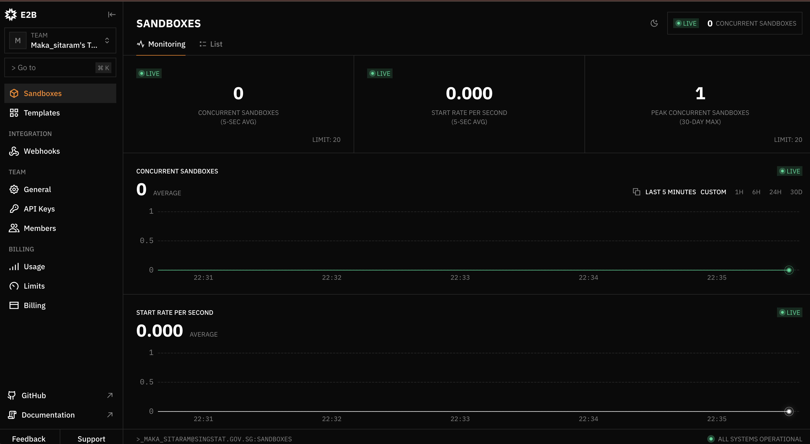

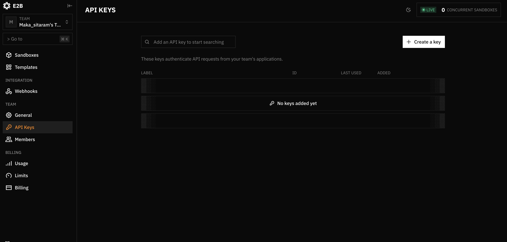

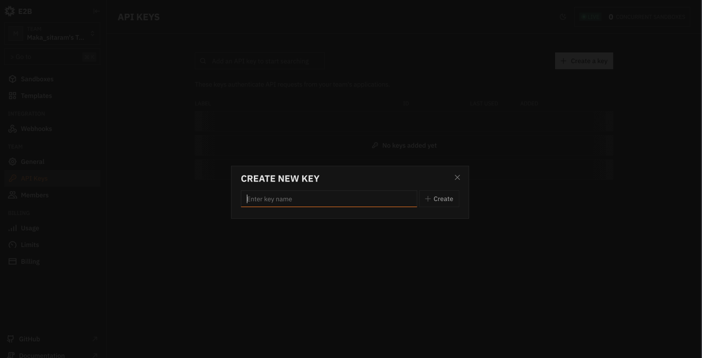

Key placeholder:

`e2b_cdbb********************************************`

Checklist:

- [ ] Can sign in to E2B.
- [ ] Can open the E2B dashboard.
- [ ] Have created or copied my E2B API key.
- [ ] Have stored the key securely.

### 3. Add E2B API Key to Dify

Connect E2B to Dify.

What you need to do:

1. Go back to Dify: `https://cloud.dify.ai`.
2. Open **Plugins** or **Tools**.
3. Find the E2B / Better E2B Sandbox plugin used for this workshop.
4. Open the credential or authorization settings.
5. Paste your E2B API key.
6. Save the configuration.

Screenshots:

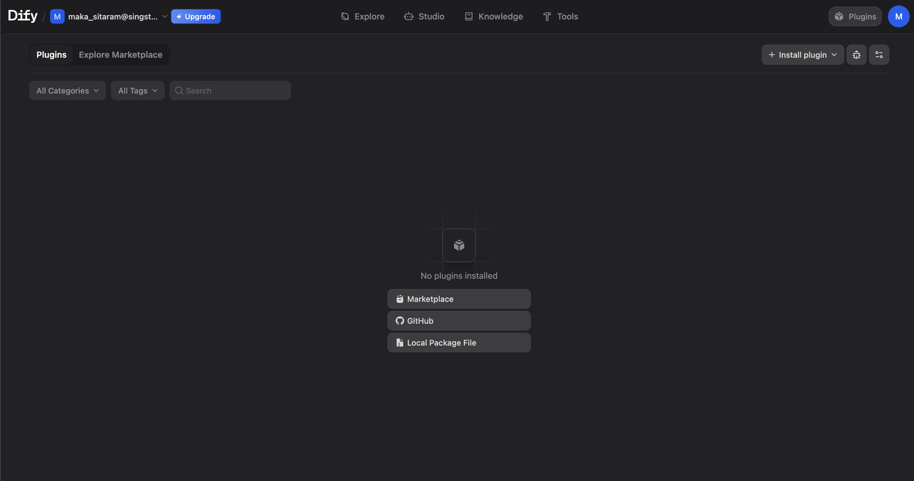

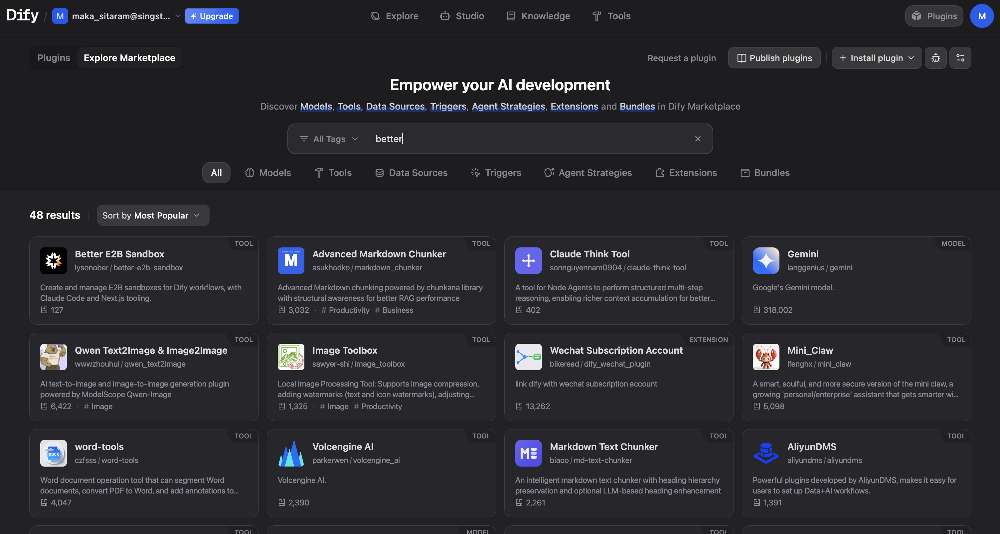

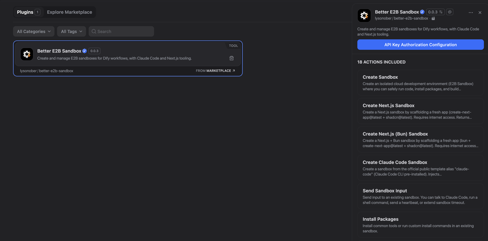

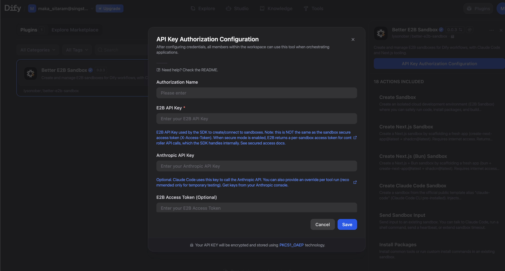

### 4. Firecrawl Account

Firecrawl is used for webpage extraction.

Open Firecrawl:

`https://www.firecrawl.dev`

Firecrawl app:

`https://www.firecrawl.dev/app`

Why we need it:

The Researcher / Web Scraper tool uses Firecrawl to read public webpages and return clean content for the agent.

What you need to do:

1. Go to `https://www.firecrawl.dev`.
2. Sign in or create an account.
3. Open the app at `https://www.firecrawl.dev/app`.
4. Create or copy your API key.
5. Keep the key ready for the Dify configuration step.

Screenshot:

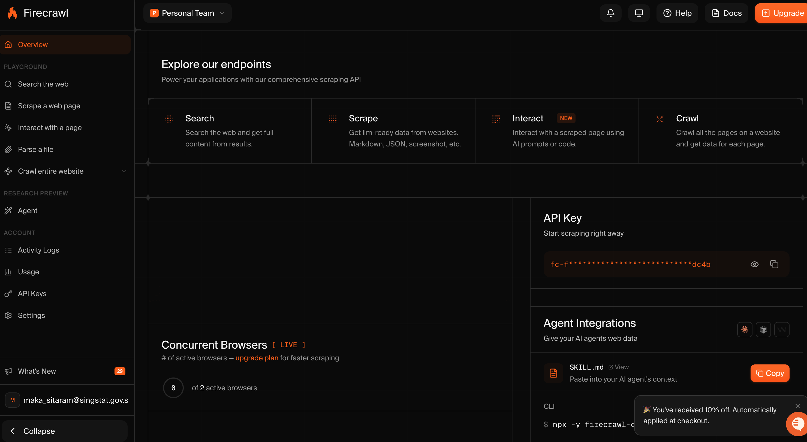

Key placeholder:

`<FIRECRAWL_API_KEY>`

Checklist:

- [ ] Can sign in to Firecrawl.
- [ ] Can open the Firecrawl app.
- [ ] Have created or copied my Firecrawl API key.
- [ ] Have stored the key securely.

### 5. Add Firecrawl API Key to Dify

Connect Firecrawl to Dify.

What you need to do:

1. Go back to Dify: `https://cloud.dify.ai`.
2. Open **Plugins** or **Tools**.
3. Find the Firecrawl plugin.
4. Open the credential or authorization settings.
5. Paste your Firecrawl API key.
6. Save the configuration.
7. Test the plugin with a public webpage if a test option is available.

Screenshots:

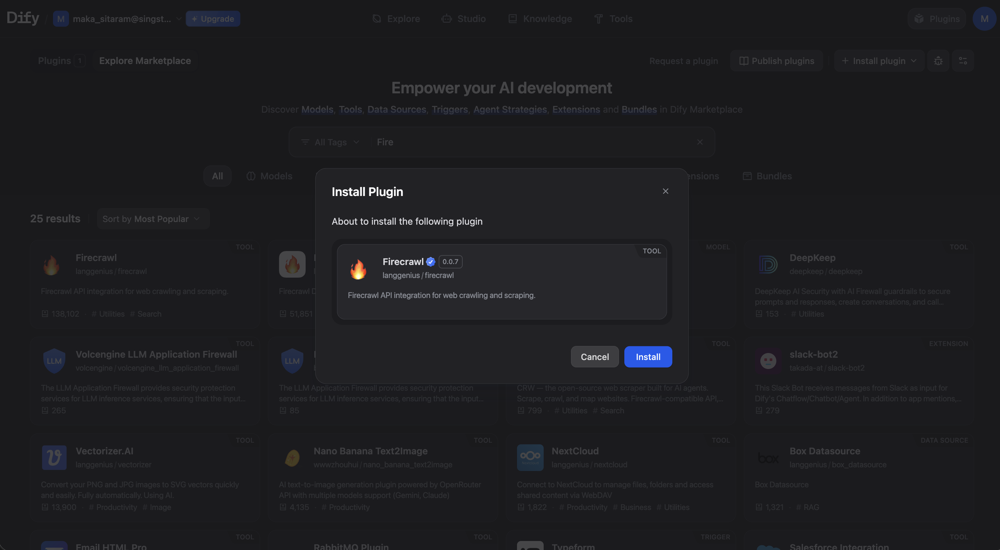

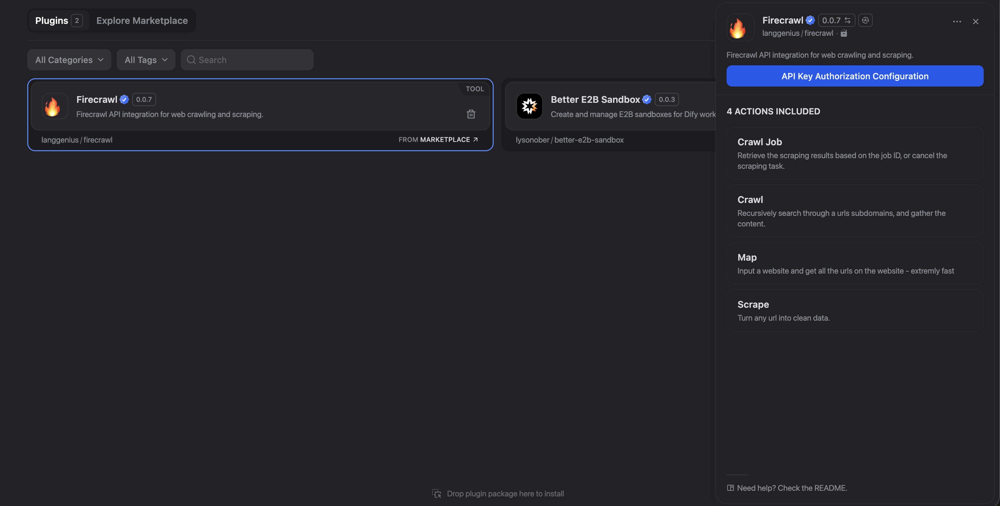

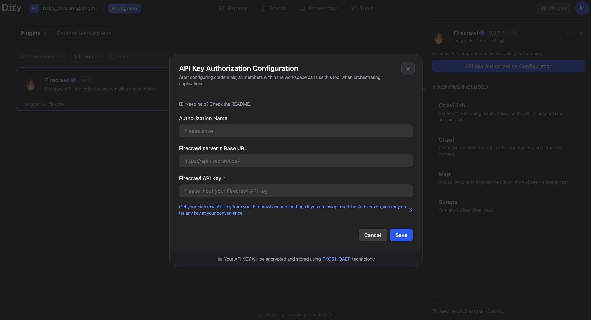

Key placeholder:

`fc-***********************`

Suggested test URL:

`https://www.singstat.gov.sg/find-data/explore-data-themes/economy-prices/consumer-price-index/latest-news-data`

### 6. Add Bedrock Model API Key to Dify

Bedrock-hosted models are used in Dify.

`<BEDROCK API KEY PROVIDER>`

Why we need it:

Dify workflows and agents need a model provider. This workshop uses Bedrock model access through API key authentication.

What you need to do in Dify:

1. Go to Dify: `https://cloud.dify.ai`.
2. Open **Model Provider Settings**.
3. Select **Amazon Bedrock** or the Bedrock provider configured for this workshop.
4. Choose **BEDROCK API KEY** if Dify gives you multiple authentication methods.
5. Paste your Bedrock API key.
6. Select or confirm the model region if required.
7. Enable the chat model used by workflows and agents.
8. Enable the embedding model used by Knowledge Base indexing.
9. Save the provider configuration.
10. Test the model connection if a test option is available.

Screenshots:

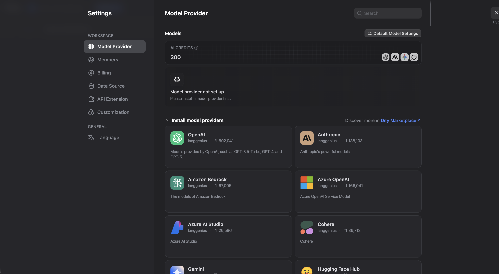

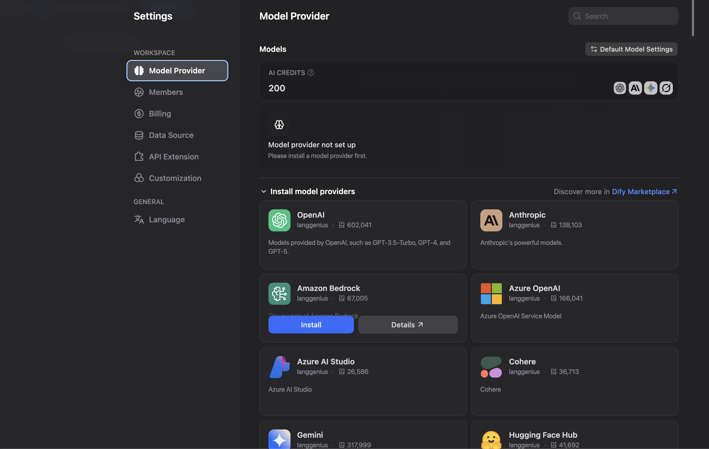

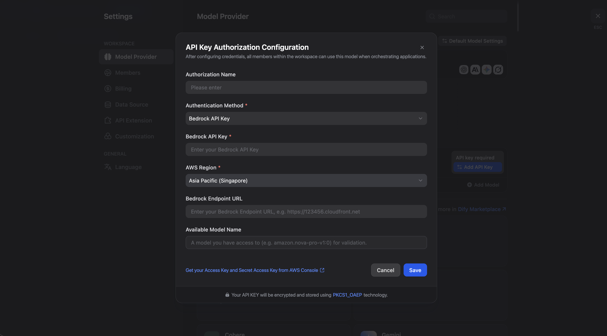

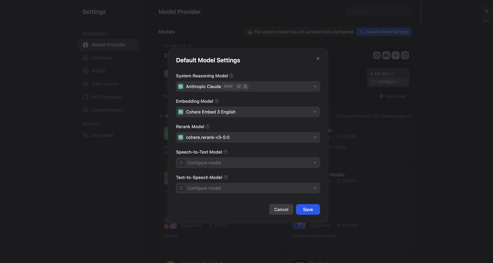

Key placeholder:

`<BEDROCK_API_KEY>`

Optional placeholders:

`<BEDROCK_REGION>` Use Singapore

`<BEDROCK_CHAT_MODEL>` ANthropic Claude Sonet 3.5

`<BEDROCK_EMBEDDING_MODEL>` cohere english

Recommended checks:

- The chat model works for workflow and agent LLM nodes.
- The embedding model works for Knowledge Base indexing.
- The selected model identifier is valid for the configured Bedrock environment.

### Setup Completion Checklist

Before we move to the next part, please confirm:

- [ ] Can access Dify.
- [ ] Can access E2B.
- [ ] Added the E2B API key to Dify.
- [ ] Can access Firecrawl.
- [ ] Added the Firecrawl API key to Dify.
- [ ] Added the Bedrock API key to Dify.
- [ ] The chat model works.
- [ ] The embedding model works.
- [ ] Dify can create an E2B sandbox.
- [ ] Dify can scrape a public webpage through Firecrawl.

Stop here before continuing to Knowledge Base, workflows, tools, and agents.

## Source Repository

All the DSL files and sample datasets for this hands-on are available in the GitHub repository below.

Repository:

`https://github.com/satyaram413/DOS-Tech-Test-Drive`

Branch:

`master`

Files used in this hands-on:

- [E2B Sandbox .yml](https://github.com/satyaram413/DOS-Tech-Test-Drive/blob/master/E2B%20Sandbox%20.yml)
- [Data Analyst.yml](https://github.com/satyaram413/DOS-Tech-Test-Drive/blob/master/Data%20Analyst.yml)
- [Web Page Researcher.yml](https://github.com/satyaram413/DOS-Tech-Test-Drive/blob/master/Web%20Page%20Researcher.yml)
- [A2A Master Agent.yml](https://github.com/satyaram413/DOS-Tech-Test-Drive/blob/master/A2A%20Master%20Agent.yml)
- `RAG_READY_DOS_TECH_DRIVE.md`
- `DemandforRentalandSoldFlats.csv`
- `PriceRangeofHDBFlatsOffered.csv`
- `HDBPropertyInformation.csv`
- `URA 21 26.csv`

The direct GitHub links above are the source of truth for imports during the hands-on.

## Important Note About Dify App Limit

Free version of Dify accounts allow only **5 apps**.

Because of this limit, the `E2B Sandbox` app should be treated as a temporary setup app.

Flow:

1. Import [E2B Sandbox .yml](https://github.com/satyaram413/DOS-Tech-Test-Drive/blob/master/E2B%20Sandbox%20.yml).
2. Run it once to create the E2B template.
3. Confirm the template is created.
4. Delete the `E2B Sandbox` app from Dify.
5. Continue with Knowledge Base, workflows, tools, and agents.

This keeps the Dify workspace clean and avoids hitting the app limit.

## E2B Template Creation From Dify

The Data Analyst workflow needs a custom E2B template with the required Python packages.

Template name:

`dos-lazypredict-flaml`

Python packages:

`lazypredict,flaml[automl]`

The template is created from Dify by importing and running the `E2B Sandbox .yml` DSL.

### Import E2B Sandbox DSL

Open the GitHub repository:

`https://github.com/satyaram413/DOS-Tech-Test-Drive`

Open the DSL file:

[E2B Sandbox .yml](https://github.com/satyaram413/DOS-Tech-Test-Drive/blob/master/E2B%20Sandbox%20.yml)

Raw DSL URL:

`https://raw.githubusercontent.com/satyaram413/DOS-Tech-Test-Drive/master/E2B%20Sandbox%20.yml`

What you need to do in Dify:

1. Go to `https://cloud.dify.ai`.
2. Open **Studio**.
3. Click **Import DSL**.
4. Select **Import URL**.
5. Copy and paste this URL:

`https://raw.githubusercontent.com/satyaram413/DOS-Tech-Test-Drive/master/E2B%20Sandbox%20.yml`

6. Click **Import**.
7. Open the imported app.
8. Check the Team Id, grab your Team ID from E2B and paste it in the Node Settings.

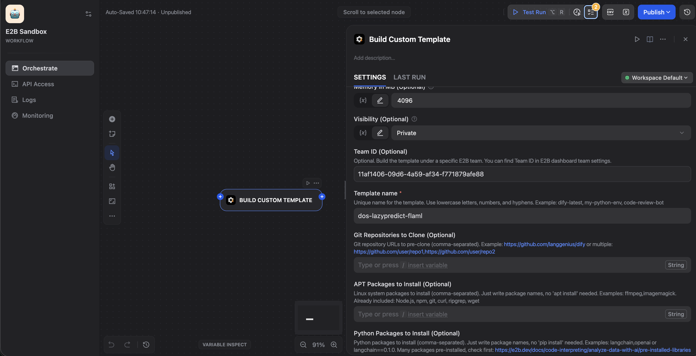

9. Confirm the template name is `dos-lazypredict-flaml`.
10. Confirm the Python packages include `lazypredict,flaml[automl]`.
11. Run the workflow once.
12. Confirm that the E2B template was created successfully.

Import and run screenshots:

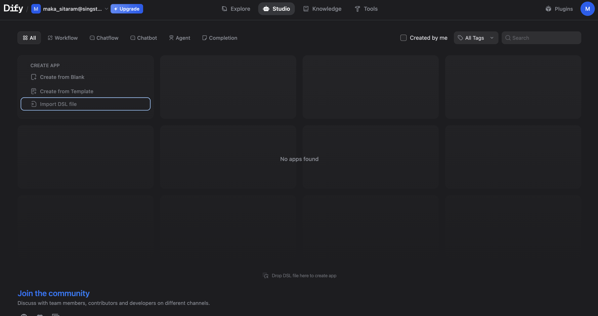

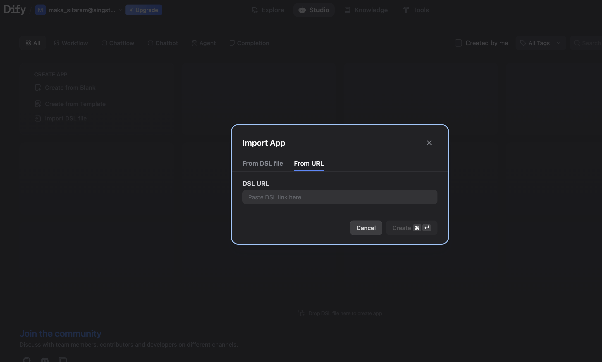

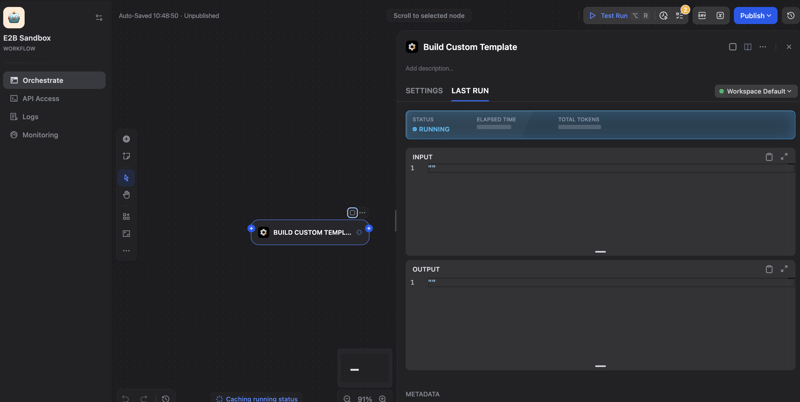

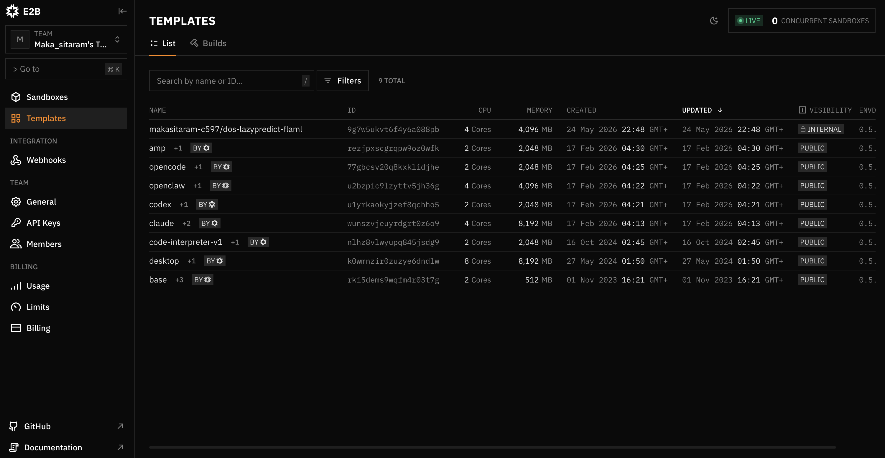

Checklist:

- [ ] Imported `E2B Sandbox .yml`.
- [ ] Confirmed template name is `dos-lazypredict-flaml`.
- [ ] Confirmed Python packages are configured.
- [ ] Ran the workflow once.
- [ ] Confirmed the E2B template was created.

### Delete E2B Sandbox App After Template Creation

Once the E2B template is created, delete the `E2B Sandbox` app from Dify.

Reason:

The app is only needed to create the template. The actual hands-on uses the template through the Data Analyst workflow, so the temporary app can be removed.

What you need to do:

1. Go to **Studio**.
2. Find the `E2B Sandbox` app.
3. Delete the app.
4. Confirm the app count is back within the Dify limit.

After deleting the app, the important confirmation is that the E2B template still exists in E2B and the Dify app count is back within the free-plan limit.

Checklist:

- [ ] E2B template exists.
- [ ] `E2B Sandbox` app deleted.
- [ ] Dify app count is within the limit.

## Knowledge Base

The Knowledge Base gives the agent workshop context and public-context information.

Create a Knowledge Base named:

`DOS Tech Drive`

What you need to do:

1. Go to `https://cloud.dify.ai`.
2. Open **Knowledge**.
3. Create a new Knowledge Base.
4. Name it `DOS Tech Drive`.
5. Select a valid embedding model.
6. Add the required documents or public sources.
7. Wait for indexing to complete.
8. Test retrieval with a simple question.

Recommended sources:

Workshop RAG document:

`https://raw.githubusercontent.com/satyaram413/DOS-Tech-Test-Drive/master/RAG_READY_DOS_TECH_DRIVE.md`

SingStat CPI page:

`https://www.singstat.gov.sg/find-data/explore-data-themes/economy-prices/consumer-price-index/latest-news-data`

Population PDF:

`https://github.com/satyaram413/DOS-Tech-Test-Drive/blob/master/population2025.pdf`

Important note:

Knowledge Base is good for retrieval and context. For exact CSV analysis, filtering, statistics, and model comparison, use the Data Analyst tool.

When adding a website source, use Firecrawl if Jina Reader is unavailable or slow.

Knowledge Base screenshots:

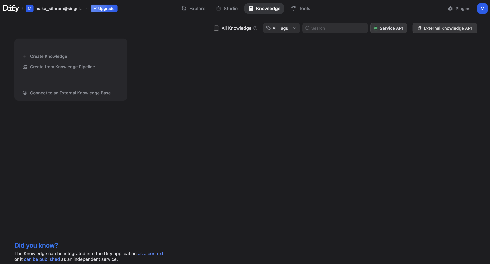

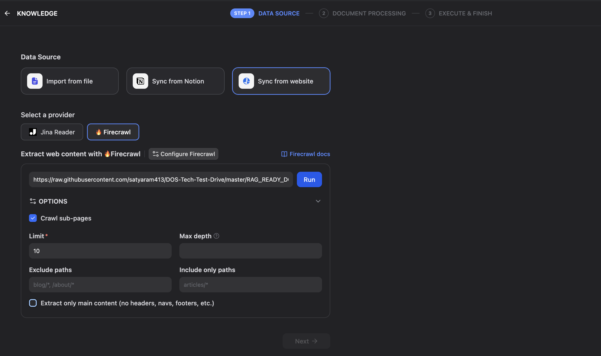

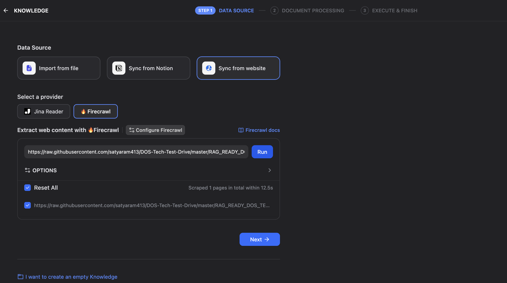

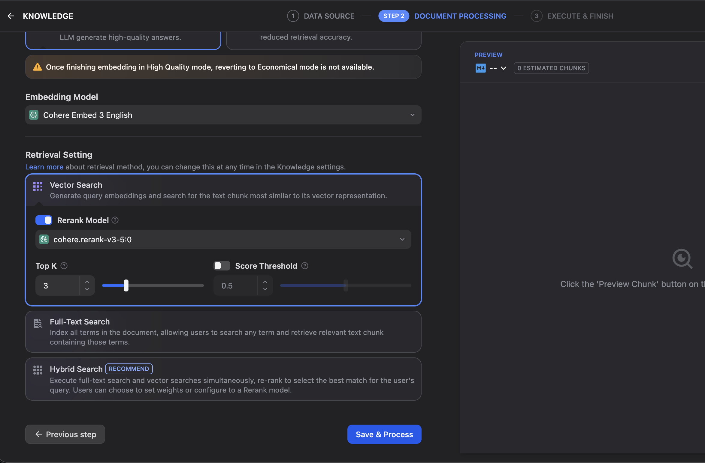

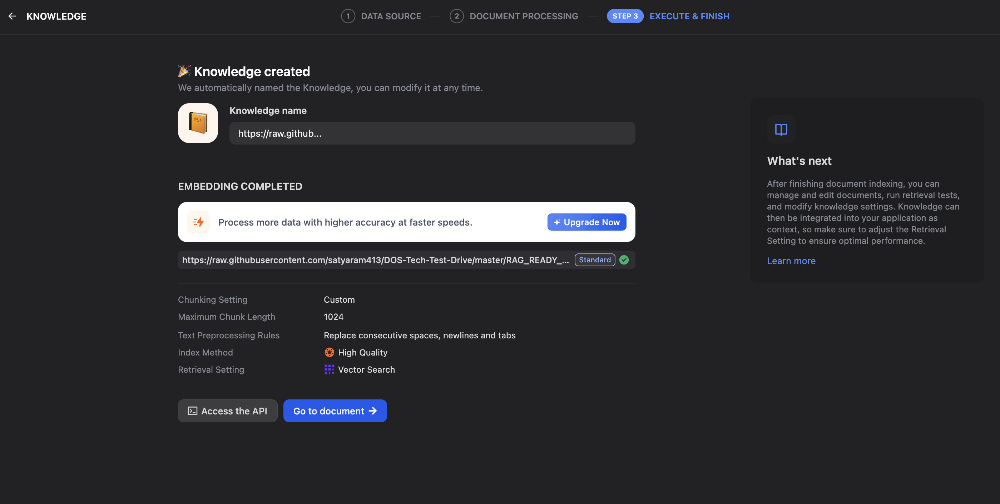

Checklist:

- [ ] Created `DOS Tech Drive` Knowledge Base.
- [ ] Added workshop context.
- [ ] Added SingStat CPI context.
- [ ] Added dataset context if needed.
- [ ] Indexing completed successfully.
- [ ] Retrieval test works.

## Workflows

Workflows will be imported into Dify through DSL files from the GitHub repository.

### Data Analyst Workflow

DSL file:

[Data Analyst.yml](https://github.com/satyaram413/DOS-Tech-Test-Drive/blob/master/Data%20Analyst.yml)

Raw DSL URL:

`https://raw.githubusercontent.com/satyaram413/DOS-Tech-Test-Drive/master/Data%20Analyst.yml`

Purpose:

The Data Analyst workflow analyzes CSV URLs using Python inside E2B. It supports descriptive statistics, charts, correlations, LazyPredict, FLAML, and model comparison.

What you need to do:

1. Go to **Studio**.
2. Click **Import DSL**.
3. Select **Import URL**.
4. Copy and paste this URL:

`https://raw.githubusercontent.com/satyaram413/DOS-Tech-Test-Drive/master/Data%20Analyst.yml`

5. Click **Import**.
6. Open the workflow.
7. Confirm the E2B template name is `dos-lazypredict-flaml`.
8. Confirm the model provider is configured correctly.
9. Publish the workflow.
10. Test it with a raw CSV URL.

Use this CSV URL: `https://raw.githubusercontent.com/satyaram413/DOS-Tech-Test-Drive/refs/heads/master/URA%2021%2026.csv`

Workflow screenshots:

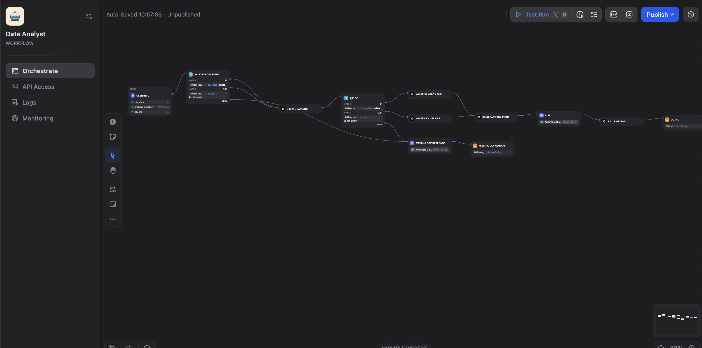

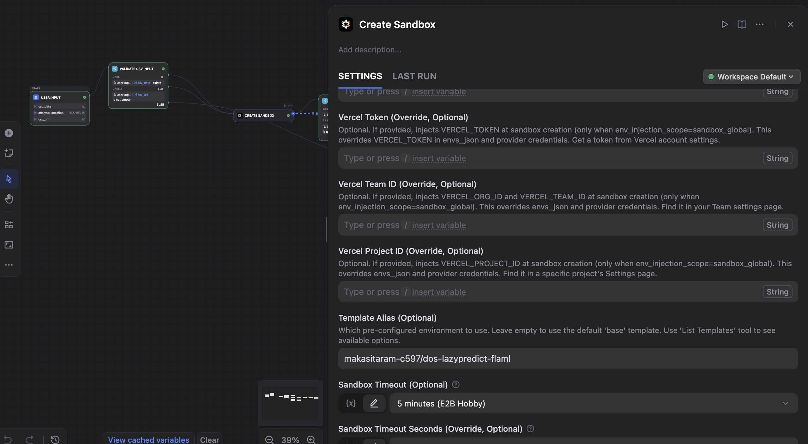

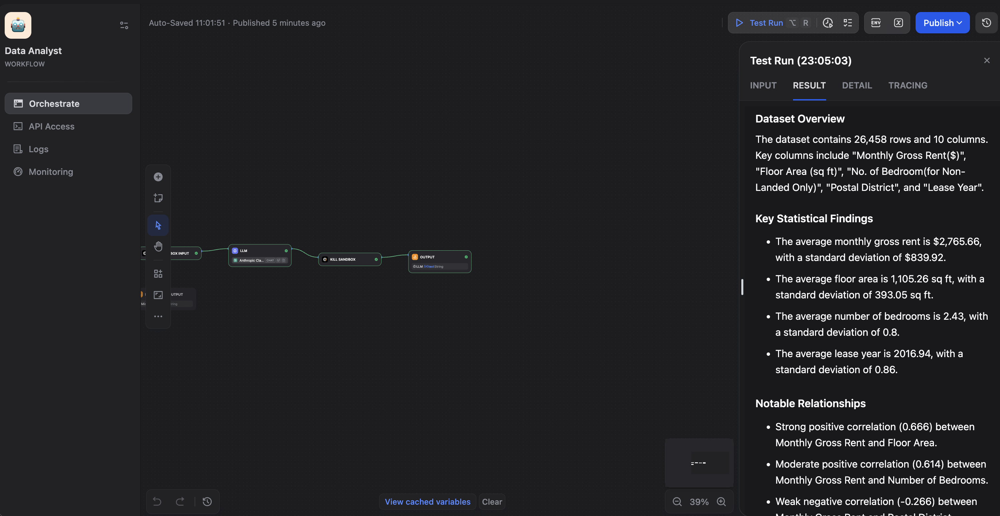

Checklist:

- [ ] Imported `Data Analyst.yml`.
- [ ] Confirmed E2B template name.
- [ ] Confirmed model settings.
- [ ] Published workflow.
- [ ] Tested with a raw CSV URL.

### Web Scraper Workflow

DSL file:

[Web Page Researcher.yml](https://github.com/satyaram413/DOS-Tech-Test-Drive/blob/master/Web%20Page%20Researcher.yml)

Raw DSL URL:

`https://raw.githubusercontent.com/satyaram413/DOS-Tech-Test-Drive/refs/heads/master/Web%20Page%20Researcher.yml`

Purpose:

The Web Scraper workflow reads public webpages and returns clean content for the agent.

What you need to do:

1. Go to **Studio**.
2. Click **Import DSL**.
3. Select **Import URL**.
4. Copy and paste this URL:

`https://raw.githubusercontent.com/satyaram413/DOS-Tech-Test-Drive/refs/heads/master/Web%20Page%20Researcher.yml`

5. Click **Import**.
6. Open the workflow.
7. Confirm the web scraping or reader configuration.
8. Confirm the model provider is configured correctly.
9. Publish the workflow.
10. Test it with a public webpage.

Suggested test URL:

`https://tablebuilder.singstat.gov.sg/`

Workflow screenshots:

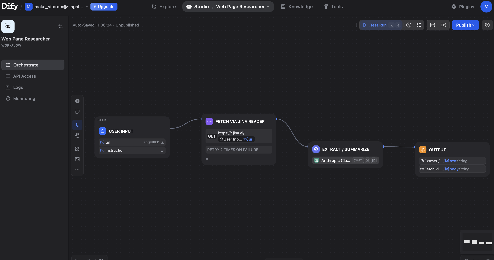

Use the suggested SingStat or TableBuilder URL above to test the workflow after import.

Checklist:

- [ ] Imported `Web Scraper.yml`.
- [ ] Confirmed scraper configuration.
- [ ] Confirmed model settings.
- [ ] Published workflow.
- [ ] Tested with a public webpage.

## Tools

The published workflows will be used as tools by the master agent.

After publishing each workflow:

1. Open the workflow.
2. Enable or expose it as a tool if required.
3. Confirm the tool name.
4. Confirm the tool description.
5. Test the tool independently before adding it to the agent.

Recommended Data Analyst tool description:

`Use this tool for CSV and structured dataset analysis. This tool accepts raw CSV URLs directly. Use it for filtering, grouping, statistics, charts, correlations, model comparison, LazyPredict, FLAML, and feature importance.`

Recommended Web Scraper tool description:

`Use this tool for public webpages, articles, reports, HTML pages, and web research. Use it when a public webpage needs to be read directly or when another source is inconclusive.`

Tool screenshots:

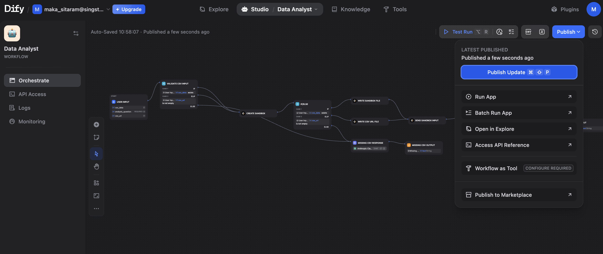

Use the same publish flow for the Web Scraper workflow, then confirm the tool name and description before attaching it to the agent.

Checklist:

- [ ] Data Analyst is available as a tool.
- [ ] Web Scraper is available as a tool.
- [ ] Tool descriptions are clear.
- [ ] Tools are tested independently.

## Agents

The master agent will also be imported through DSL.

DSL file:

[A2A Master Agent.yml](https://github.com/satyaram413/DOS-Tech-Test-Drive/blob/master/A2A%20Master%20Agent.yml)

Raw DSL URL:

`https://raw.githubusercontent.com/satyaram413/DOS-Tech-Test-Drive/master/A2A%20Master%20Agent.yml`

Purpose:

The master agent uses the Knowledge Base and decides whether to call Data Analyst, Web Scraper, Yahoo Ticker, or answer from retrieved context.

What you need to do:

1. Go to **Studio**.
2. Click **Import DSL**.
3. Select **Import URL**.
4. Copy and paste this URL:

`https://raw.githubusercontent.com/satyaram413/DOS-Tech-Test-Drive/master/A2A%20Master%20Agent.yml`

5. Click **Import**.
6. Open the imported agent.
7. Attach the `DOS Tech Drive` Knowledge Base.
8. Add the Data Analyst tool.
9. Add the Web Scraper tool.
10. Add Yahoo Ticker if required.
11. Review the agent instructions.
12. Publish the agent.

Agent screenshots:

Attach the `DOS Tech Drive` Knowledge Base after import.

Add the published Data Analyst and Web Scraper tools after they are tested independently.

Publish the master agent only after the Knowledge Base and tools are attached.

Checklist:

- [ ] Imported `A2A Master Agent.yml`.
- [ ] Attached `DOS Tech Drive` Knowledge Base.
- [ ] Added Data Analyst tool.
- [ ] Added Web Scraper tool.
- [ ] Added Yahoo Ticker if required.
- [ ] Reviewed agent instructions.
- [ ] Published the agent.

## Import Checkpoint

At this point, the workspace should contain only the apps needed for the hands-on.

Expected active apps:

- `Data Analyst`
- `Web Scraper`
- `A2A Master Agent`
- `E2B Sandbox`
- `A2A Data Agent`

Checklist:

- [ ] E2B template created.
- [ ] Temporary E2B Sandbox app deleted.
- [ ] Knowledge Base created.
- [ ] Data Analyst workflow imported and published.
- [ ] Web Scraper workflow imported and published.
- [ ] Master Agent imported and published.
- [ ] App count is within the Dify limit.
