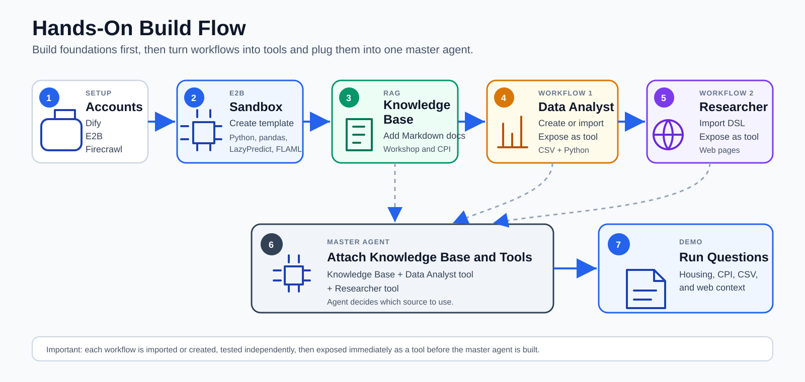

# DOS Tech Drive Hands-On Guide

## Presenters

Presenters: `Leh Hoon Lim`
`Gladys Chiam`
`Jian Bo Cai`
`Ng Jing Kiat`
`Maka Sitaram`


This hands-on guide shows how to build an AI assistant that can use tools, read from a Knowledge Base, analyze structured data, and combine public context with data-driven answers.

The hands-on uses a Singapore housing and cost-of-living storyline so the agent behavior can be tested against realistic questions. The goal is to understand how Dify agents decide when to use Knowledge Base, when to call tools, and when to fall back to web research.

Please note this is just experimental the answers generated by AI are not accurate or final

## What We Are Building

The hands-on flow starts with the platform setup, then creates the E2B sandbox template, the Knowledge Base, and the workflows. Each workflow is tested and exposed as a tool immediately before it is attached to the master agent.



## Agenda

Session flow:


1. Setup
   - Sign in to Dify.
   - Prepare E2B for Python sandbox execution.
   - Add the E2B API key to Dify.
   - Prepare Firecrawl for web scraping.
   - Add the Firecrawl API key to Dify.
   - Add Bedrock model credentials to Dify.

2. Knowledge Base / RAG
   - Create a Dify Knowledge Base.
   - Add workshop and public-context material.
   - Understand when the agent should use RAG and when it should use tools.

3. Tool Building
   - Build or import a Data Analyst tool.
   - Build or import a Researcher / Web Scraper tool.
   - Validate each tool independently before attaching it to an agent.

4. Agent Building
   - Create a master agent.
   - Attach the Knowledge Base.
   - Add Data Analyst, Researcher, and other tools.
   - Tune the agent instructions so it can route tasks properly.

5. Demo Scenario
   - Ask housing and cost-of-living questions.
   - Let the agent decide when to use Knowledge Base, Data Analyst, and Researcher.
   - Review tool calls, answers, limitations, and fallback behavior.

6. Wrap-Up
   - Review what worked.
   - Review what failed.
   - Understand how tool descriptions and agent instructions affect behavior.
   - Close with next steps for production use.

## Setup

Complete this setup before building tools or agents. Most workflow failures later come from missing keys or incorrect model configuration.

### 1. Dify Account

Dify is the main platform for this hands-on.

Open Dify:

`https://cloud.dify.ai`


What you need to do:

1. Go to `https://cloud.dify.ai`.
2. Sign in or create an account.
3. Create or select your workspace.
4. Confirm that you can access:
   - Studio
   - Knowledge
   - Tools
   - Plugins
   - Model Provider settings

Screenshot:


### 2. E2B Account

E2B is used to run Python code inside a sandbox.

Open E2B:

`https://e2b.dev`

E2B dashboard:

`https://e2b.dev/dashboard`

API KEY:
`e2b_ed278f22d1aeb72860082b38d32c6a21a9f09453`
`241d9294-d4ae-4836-803f-e6ca4d65b69a`
Why we need it:

Our Data Analyst workflow uses E2B to run Python, pandas, charts, LazyPredict, and FLAML. Without E2B, the analysis tool cannot create a sandbox or run code.

What you need to do:

1. Go to `https://e2b.dev`.
2. Sign in or create an account.
3. Open the dashboard at `https://e2b.dev/dashboard`.
4. Create or copy your API key.
5. Keep the key ready for the Dify configuration step.

Screenshots:


Key placeholder:

`e2b_cdbb********************************************`

Checklist:

- <input type="checkbox"> Can sign in to E2B.
- <input type="checkbox"> Can open the E2B dashboard.
- <input type="checkbox"> Have created or copied my E2B API key.
- <input type="checkbox"> Have stored the key securely.

### 3. Add E2B API Key to Dify

Connect E2B to Dify.

What you need to do:

1. Go back to Dify: `https://cloud.dify.ai`.
2. Open **Plugins** or **Tools**.
3. Find the E2B / Better E2B Sandbox plugin used for this workshop.
4. Open the credential or authorization settings.
5. Paste your E2B API key.
6. Save the configuration.

Screenshots:


### 4. Firecrawl Account

Firecrawl is used for webpage extraction.

Open Firecrawl:

`https://www.firecrawl.dev`

Firecrawl app:

`https://www.firecrawl.dev/app`

Why we need it:

The Researcher / Web Scraper tool uses Firecrawl to read public webpages and return clean content for the agent.

What you need to do:

1. Go to `https://www.firecrawl.dev`.
2. Sign in or create an account.
3. Open the app at `https://www.firecrawl.dev/app`.
4. Create or copy your API key.
5. Keep the key ready for the Dify configuration step.

Screenshot:


Key placeholder:

`fc-***********************`

Checklist:

- <input type="checkbox"> Can sign in to Firecrawl.
- <input type="checkbox"> Can open the Firecrawl app.
- <input type="checkbox"> Have created or copied my Firecrawl API key.
- <input type="checkbox"> Have stored the key securely.

### 5. Add Firecrawl API Key to Dify

Connect Firecrawl to Dify.

What you need to do:

1. Go back to Dify: `https://cloud.dify.ai`.
2. Open **Plugins** or **Tools**.
3. Find the Firecrawl plugin.
4. Open the credential or authorization settings.
5. Paste your Firecrawl API key.
6. Save the configuration.
7. Test the plugin with a public webpage if a test option is available.

Screenshots:


Key placeholder:

`fc-***********************`

Suggested test URL:

`https://tablebuilder.singstat.gov.sg/`

Do not use the direct SingStat CPI news page for the live scraper test. It can be blocked by Cloudflare. TableBuilder is the safer demo URL.


### 6. Add Bedrock Model API Key to Dify

Bedrock-hosted models are used in Dify.

Why we need it:

Dify workflows and agents need a model provider. This workshop uses Bedrock model access through API key authentication.

What you need to do in Dify:

1. Go to Dify: `https://cloud.dify.ai`.
2. Open **Model Provider Settings**.
3. Select **Amazon Bedrock** or the Bedrock provider configured for this workshop.
4. Choose **BEDROCK API KEY** if Dify gives you multiple authentication methods.
5. Paste your Bedrock API key.
6. Select or confirm the model region if required.
7. Enable the chat model used by workflows and agents.
8. Enable the embedding model used by Knowledge Base indexing.
9. Save the provider configuration.
10. Test the model connection if a test option is available.

Screenshots:


Key placeholder:

`bedrock-api-key-YmVkcm9jay5hbWF6b25hd3MuY29tLz9BY3Rpb249Q2FsbFdpdGhCZWFyZXJUb2tlbiZYLUFtei1BbGdvcml0aG09QVdTNC1ITUFDLVNIQTI1NiZYLUFtei1DcmVkZW50aWFsPUFTSUFTSEFJU0lWUU9NMk1UMlpXJTJGMjAyNjA1MjYlMkZhcC1zb3V0aGVhc3QtMSUyRmJlZHJvY2slMkZhd3M0X3JlcXVlc3QmWC1BbXotRGF0ZT0yMDI2MDUyNlQwMjA0NDlaJlgtQW16LUV4cGlyZXM9NDMyMDAmWC1BbXotU2VjdXJpdHktVG9rZW49SVFvSmIzSnBaMmx1WDJWakVLciUyRiUyRiUyRiUyRiUyRiUyRiUyRiUyRiUyRiUyRndFYURtRndMWE52ZFhSb1pXRnpkQzB4SWtZd1JBSWdPWk92JTJGWHl6cDNkVmZyMFFVUjVkekJXSEtxZWJObnh3Q21oJTJGU2xLdVc4Z0NJRVRWa29POGpadDElMkIzSWRwM0tWYUNBM2pWZk1ZVGViMnU1aGVXNk1nNHNFS3NJRkNITVFBUm9NTVRVeU5EZzVNekV6TmpNeUlnd2ZmeGcxMk1MVVRObXNzcXdxbndXV0MlMkJBMmk5ZDlZM25VczFZRUNvSEZrRjhVZDJMblZIbVc3M0s4SnR0Q1JiWUl6alJ0eUN3bnEyN2VQbU1zc0dOOUVrcjY1Y2dSV1RHQ1pwN2w3eVpWdlVXOEJjOEh5aiUyRmNEb0NmcVolMkJaSk03VjlvSzRlc0huNXhNTHVINEoxQ0xMeFNjR3hWUnJ6WWhCZXJYdTRoTHpBaGo3U1BhQWolMkZSb2ZFRSUyRmNTTlZlQXZCNlVBanIlMkZUbHpsRk42dU1ndzlxM3klMkJZQ0hIZTVpdFI5SFRST2tXTUtnaDY1SUxmUWU2STFiOFBjQVA0YnlXZkdzT2drZW9wSnBOMHRqQlRDeWN5WUhhOXRUTWRJOXNtcFFWODRoOUFEQjNEVjRZZmdZSVNIZ1BHbXlpMlNEbzlhTzk3VWdVdGZwVzV1aVYwYSUyRlR2Mk1JWHlwOFFmeHhGSUlPVWFHOUVYVFZKSlJNb21nY2FNMEVlTFlwJTJCNSUyQm9kZjl4T3FGUjJDZ2dVVWJnbVpNTktRcHBINlMyUTFRTXFQSHRxeldnMWolMkJjWUZobSUyRkJmSGZ6d2FkMEYlMkZuYmNrekN3b1U4aDR6VGN3OHklMkZ2NXVOS1BCMFA1UmlvUmppZndUNkpsQ2RSJTJGJTJGQmU5OTJaazB5YWtFbFJCcyUyQkJDQTM2ekd3TXVsTFdOYkJqZ3p4S2F3NXpEUWdMWFFtZ01mSTFrVFpjMlBCTGolMkZJYzFka0slMkIzaiUyQjdEWHllMTFlMDVKeUh4SUhhNXJYNDRYMXprakFjeHNxTHR1QTJpOHB5TEFTZ3VOeTdEeG1jcDREUVk5cCUyRjJ1TFRxbFVZTENZZktQcEVBVm9aTjNJT1BYUkZuJTJCZFZZMFZReiUyRnREeEZPU1pwSXdBOTcwdE1DZ1gydnBNblJZOU1TQUJBR1BnWWZ5bGRhTWRxMmlZZXRiOEgzbmkwbnNBdU9sMlUxN2lZQ3l4c3czaEt1Nk8lMkJXSm1GN2t6bGdiTyUyQlR5eCUyRmUlMkJoZFh1Vm9QQnQlMkJYJTJGcDI2cDRXTmRxOWkyZUN3V3BYRmRFYlRINWRXalpnejZXdSUyRmpxQjdqUFF4NHZ5QmlBYkFvbk95WTRTekRmN2xRakxmTWhMMXVSZWlFWVFKZkIxOWIzMjVwcGNpemNUOFBvNW5rZUhwd2YlMkZCU2xLenNpaWxLODFyQlZrZWxhJTJCTEhBdSUyRjVxc2pwVnpQV09EVEMwJTJGOVBRQmpySUFwUk5xZTE1V1IybjJnM2FYRTM0djU5MjUlMkZLYUg3eTZPdk5FT0Yydm9OcmclMkYyUjcyY3RRczBHS29ha3F1dUZ3UTB3WkVTQlBaeEo5TDZGU2NnWmFhNjA3TUx4OTREZmZsZUk3YnBVUEo1WmU5VjNMeUFGWkVTcG9UbHd6Q1ZCZ2NacWZYTnYlMkJ1OGdyajZRcjE2czlyMnpTQVhCZ3pZQjBFZ1ZIYjJvNSUyRldHd0NzMDR6TmhHUmtwYXBLRGJqZXNaaTlGMGNuNTJlQW0ySTdSWHR4aEQwUmN2NGVYbnRBZmhqUExIR09NdklOVmtYSlJ0QWdoakRhYzVTSjVHODd5UDZVd3g0dHhDanBzRzNBWlZVNnpWcWtTOVM4aUFXazQ3N0R6emd5ZDl1MnQ0enNldXF4c2lUVWZvVjdXcWkyRkJzMFl1blpjJTJGelpvayUyQnU3dSUyQlFVTzVZbkZjNlVWR1JUcExuc2V2OVI3cG1valRDVm1BbWk2WEZBNmNFbzlwWFElMkY1aDFSWnpSSnIzamF2cnFwZ0hBUjNROTFuQ3R3bmhVYWtPRHBwNnJ5WEpIaVFJUFhYdmRCJTJCYk0lM0QmWC1BbXotU2lnbmF0dXJlPWE0M2QzODZjYWMyYjUzNDk3ZmEwMWFkNDY4NDI0ZTFjYzc3N2QxN2E3NWRjODJjYWZkZGNhMGU4ZWY0OThiMjImWC1BbXotU2lnbmVkSGVhZGVycz1ob3N0JlZlcnNpb249MQ==`

Optional placeholders:

`<BEDROCK_REGION>` Use Singapore

`<BEDROCK_CHAT_MODEL>` ANthropic Claude Sonet 3.5

`<BEDROCK_EMBEDDING_MODEL>` cohere english

Recommended checks:

- The chat model works for workflow and agent LLM nodes.
- The embedding model works for Knowledge Base indexing.
- The selected model identifier is valid for the configured Bedrock environment.

### Setup Completion Checklist

Before we move to the next part, please confirm:

- <input type="checkbox"> Can access Dify.
- <input type="checkbox"> Can access E2B.
- <input type="checkbox"> Added the E2B API key to Dify.
- <input type="checkbox"> Can access Firecrawl.
- <input type="checkbox"> Added the Firecrawl API key to Dify.
- <input type="checkbox"> Added the Bedrock API key to Dify.
- <input type="checkbox"> The chat model works.
- <input type="checkbox"> The embedding model works.
- <input type="checkbox"> Dify can create an E2B sandbox.
- <input type="checkbox"> Dify can scrape a public webpage through Firecrawl.

Stop here before continuing to Knowledge Base, workflows, tools, and agents.

## Source Repository

All the DSL files and sample datasets for this hands-on are available in the GitHub repository below.

Repository:

`https://github.com/satyaram413/DOS-Tech-Test-Drive`

Branch:

`master`

Files used in this hands-on:

- [E2B Sandbox .yml](https://github.com/satyaram413/DOS-Tech-Test-Drive/blob/master/E2B%20Sandbox%20.yml)
- [Simple Data Analyst.yml](https://github.com/satyaram413/DOS-Tech-Test-Drive/blob/master/Simple%20Data%20Analyst.yml)
- [Data Analyst.yml](https://github.com/satyaram413/DOS-Tech-Test-Drive/blob/master/Data%20Analyst.yml)
- [Web Page Researcher.yml](https://github.com/satyaram413/DOS-Tech-Test-Drive/blob/master/Web%20Page%20Researcher.yml)
- [A2A Master Agent.yml](https://github.com/satyaram413/DOS-Tech-Test-Drive/blob/master/A2A%20Master%20Agent.yml)
- [A2A Data Agent.yml](https://github.com/satyaram413/DOS-Tech-Test-Drive/blob/master/A2A%20Data%20Agent.yml)
- [scripts/data_analyst.py](https://github.com/satyaram413/DOS-Tech-Test-Drive/blob/master/scripts/data_analyst.py)
- `RAG_READY_DOS_TECH_DRIVE.md`
- `DemandforRentalandSoldFlats.csv`
- `HDBPropertyInformation.csv`
- `URA 21 26.csv`

The direct GitHub links above are the source of truth for imports during the hands-on.

## Important Note About Dify App Limit

Free version of Dify accounts allow only **5 apps**.


## E2B Template Creation From Dify

The Data Analyst workflow needs a custom E2B template with the required Python packages.

Template name:

`dos-lazypredict-flaml`

Python packages:

`lazypredict,flaml[automl]`

The template is created from Dify by importing and running the `E2B Sandbox .yml` DSL.

### Import E2B Sandbox DSL

Open the GitHub repository:

`https://github.com/satyaram413/DOS-Tech-Test-Drive`

Open the DSL file:

[E2B Sandbox .yml](https://github.com/satyaram413/DOS-Tech-Test-Drive/blob/master/E2B%20Sandbox%20.yml)

Raw DSL URL:

`https://raw.githubusercontent.com/satyaram413/DOS-Tech-Test-Drive/master/E2B%20Sandbox%20.yml`

What you need to do in Dify:

1. Go to `https://cloud.dify.ai`.
2. Open **Studio**.
3. Click **Import DSL**.
4. Select **Import URL**.
5. Copy and paste this URL:

`https://raw.githubusercontent.com/satyaram413/DOS-Tech-Test-Drive/master/E2B%20Sandbox%20.yml`

6. Click **Import**.

   

7. Open the imported app.

   

8. Check the Team Id, grab your Team ID from E2B and paste it in the Node Settings.

   

9. Confirm the template name is `dos-lazypredict-flaml`.
10. Confirm the Python packages include `lazypredict,flaml[automl]`.

11. Run the workflow once.
12. Confirm that the E2B template was created successfully.

    

    

Checklist:

- <input type="checkbox"> Imported `E2B Sandbox .yml`.
- <input type="checkbox"> Confirmed template name is `dos-lazypredict-flaml`.
- <input type="checkbox"> Confirmed Python packages are configured.
- <input type="checkbox"> Ran the workflow once.
- <input type="checkbox"> Confirmed the E2B template was created.

## Knowledge Base

The Knowledge Base gives the agent workshop context and public-context information.

Create a Knowledge Base named:

`DOS Tech Drive`

What you need to do:

1. Go to `https://cloud.dify.ai`.
2. Open **Knowledge**.
3. Create a new Knowledge Base.

   

   

   

4. Name it `DOS Tech Drive`.
5. Select a valid embedding model.

   

6. Add the required documents or public sources.
7. Wait for indexing to complete.

   

8. Test retrieval with a simple question.

Recommended sources:

Workshop RAG document:

`https://raw.githubusercontent.com/satyaram413/DOS-Tech-Test-Drive/master/RAG_READY_DOS_TECH_DRIVE.md`


Recommended Knowledge Base test questions:

1. `What is the purpose of the DOS Tech Drive hands-on, and what are the main components we are building?`
2. `What is the difference between using the Knowledge Base, Data Analyst, and Web Scraper in this workshop?`
3. `When should the agent avoid using the Knowledge Base alone and call a tool instead?`
4. `What are the libraries used in dos-lazypredict-flaml template`

Important note:

Knowledge Base is good for retrieval and context. For exact CSV analysis, filtering, statistics, and model comparison, use the Data Analyst tool.

When adding a website source, use Firecrawl if Jina Reader is unavailable or slow.

Checklist:

- <input type="checkbox"> Created `DOS Tech Drive` Knowledge Base.
- <input type="checkbox"> Added workshop context.
- <input type="checkbox"> Added SingStat CPI context.
- <input type="checkbox"> Added dataset context if needed.
- <input type="checkbox"> Indexing completed successfully.
- <input type="checkbox"> Retrieval test works.

## Workflows

Start the workflow section by creating a simple workflow from scratch. This helps participants understand the moving parts before importing the larger DSL workflows.

After the simple workflow is working, the remaining workflows can be imported through DSL files from the GitHub repository.

### Simple Data Analyst Workflow

This is the first workflow to build during the hands-on.

Purpose:

The Simple Data Analyst workflow shows the basic pattern for running Python in E2B from Dify:

1. Accept a CSV URL and analysis question.
2. Create an E2B sandbox.
3. Write the CSV URL into the sandbox.
4. Run Python from **Send Sandbox Input**.
5. Send the Python JSON output to an LLM for a readable answer.

Code file:

[scripts/data_analyst.py](https://github.com/satyaram413/DOS-Tech-Test-Drive/blob/master/scripts/data_analyst.py)

Optional reference DSL:

[Simple Data Analyst.yml](https://github.com/satyaram413/DOS-Tech-Test-Drive/blob/master/Simple%20Data%20Analyst.yml)

Build it from scratch in Dify:

1. Go to **Studio**.
2. Click **Create from Blank**.
3. Choose **Workflow**.
4. Name it `Simple Data Analyst`.
5. Add these Start node inputs:
   - `csv_url`
   - `analysis_question`
6. Add a **Create Sandbox** node.
7. Use the E2B template alias created earlier:
   - `dos-lazypredict-flaml`
8. Add a **Write Sandbox File** node for the CSV URL.
9. Configure the Write Sandbox File node:
   - `sandbox_id`: output from **Create Sandbox**
   - `file_path`: `/home/user/data/input.url`
   - `content`: Start node `csv_url`
10. Add a **Send Sandbox Input** node.
11. Configure Send Sandbox Input:
   - `sandbox_id`: output from **Create Sandbox**
   - `action`: `shell_command`
   - `input_text`: paste the code from `scripts/data_analyst.py`
12. In the pasted code, make sure the `analysis_question` variable points to the Start node `analysis_question` input for this workflow.
13. Add an LLM node after **Send Sandbox Input**.
14. The LLM node must summarize the output from **Send Sandbox Input**, not the Write Sandbox File node.
15. Add a **Kill Sandbox** node.
16. Add an **End** node.

Important wiring note:

Recommended LLM prompt:

```text
You are a senior statistician. You receive raw JSON output from a pandas analysis and produce a clear answer.

Question:
{{analysis_question}}

Python JSON output:
{{Send Sandbox Input.text}}

Use only the JSON output. If the requested answer is not present, say what is missing.
```

Recommended test CSV:

`https://raw.githubusercontent.com/satyaram413/DOS-Tech-Test-Drive/refs/heads/master/URA%2021%2026.csv`

Recommended test questions:

1. `Using this CSV, what is the lowest monthly gross rent and which row does it come from?`
2. `Summarize the dataset shape, missing values, numeric summaries, and strongest correlations.`
3. `Does rent appear related to floor area, number of bedrooms, postal district, or lease year? Use only the data output.`

Checklist:

- <input type="checkbox"> Created `Simple Data Analyst` from blank.
- <input type="checkbox"> Added `csv_url` and `analysis_question` inputs.
- <input type="checkbox"> Created an E2B sandbox.
- <input type="checkbox"> Wrote the CSV URL to `/home/user/data/input.url`.
- <input type="checkbox"> Added the Python code from `scripts/data_analyst.py` to Send Sandbox Input.
- <input type="checkbox"> Connected the LLM node to **Send Sandbox Input** output.
- <input type="checkbox"> Tested with the URA CSV URL.

### Data Analyst Workflow

DSL file:

[Data Analyst.yml](https://github.com/satyaram413/DOS-Tech-Test-Drive/blob/master/Data%20Analyst.yml)

Raw DSL URL:

`https://raw.githubusercontent.com/satyaram413/DOS-Tech-Test-Drive/master/Data%20Analyst.yml`

Purpose:

The Data Analyst workflow analyzes CSV URLs using Python inside E2B. It supports descriptive statistics, charts, correlations, LazyPredict, FLAML, and model comparison.

What you need to do:

1. Go to **Studio**.
2. Click **Import DSL**.
3. Select **Import URL**.
4. Copy and paste this URL:

`https://raw.githubusercontent.com/satyaram413/DOS-Tech-Test-Drive/master/Data%20Analyst.yml`

5. Click **Import**.

   

6. Open the workflow.

   

7. Confirm the E2B template name is `dos-lazypredict-flaml`.

   

8. Confirm the model provider is configured correctly.
9. Publish the workflow.
10. Test it with a raw CSV URL.

    

Use this CSV URL: `https://raw.githubusercontent.com/satyaram413/DOS-Tech-Test-Drive/refs/heads/master/URA%2021%2026.csv`

Recommended test questions:

1. `Analyze this URA rental CSV and summarize monthly gross rent patterns by lease year, postal district, number of bedrooms, and floor area: https://raw.githubusercontent.com/satyaram413/DOS-Tech-Test-Drive/refs/heads/master/URA%2021%2026.csv`
2. `Using this URA rental CSV, build a model to predict monthly gross rent. Compare the best-performing models and explain which features matter most: https://raw.githubusercontent.com/satyaram413/DOS-Tech-Test-Drive/refs/heads/master/URA%2021%2026.csv`
3. `Use this URA rental CSV to explain whether floor area and number of bedrooms appear related to monthly gross rent. Include correlations and limitations: https://raw.githubusercontent.com/satyaram413/DOS-Tech-Test-Drive/refs/heads/master/URA%2021%2026.csv`

Checklist:

- <input type="checkbox"> Imported `Data Analyst.yml`.
- <input type="checkbox"> Confirmed E2B template name.
- <input type="checkbox"> Confirmed model settings.
- <input type="checkbox"> Published workflow.
- <input type="checkbox"> Tested with a raw CSV URL.

### Web Scraper Workflow

DSL file:

[Web Page Researcher.yml](https://github.com/satyaram413/DOS-Tech-Test-Drive/blob/master/Web%20Page%20Researcher.yml)

Raw DSL URL:

`https://raw.githubusercontent.com/satyaram413/DOS-Tech-Test-Drive/refs/heads/master/Web%20Page%20Researcher.yml`

Purpose:

The Web Scraper workflow reads public webpages and returns clean content for the agent.

What you need to do:

1. Go to **Studio**.
2. Click **Import DSL**.
3. Select **Import URL**.
4. Copy and paste this URL:

`https://raw.githubusercontent.com/satyaram413/DOS-Tech-Test-Drive/refs/heads/master/Web%20Page%20Researcher.yml`

5. Click **Import**.
6. Open the workflow.
7. Confirm the web scraping or reader configuration.
8. Confirm the model provider is configured correctly.
9. Publish the workflow.
10. Test it with a public webpage.

Suggested test URL:

`https://tablebuilder.singstat.gov.sg/`

Recommended test questions:

1. `Read this SingStat TableBuilder page and explain what kind of data a user can look for there: https://tablebuilder.singstat.gov.sg/`
2. `Read this SingStat TableBuilder page and summarize how a user can search for Consumer Price Index, prices, or housing-related tables: https://tablebuilder.singstat.gov.sg/`
3. `Use this public page to extract the most relevant entry points for a Singapore cost-of-living discussion: https://tablebuilder.singstat.gov.sg/`

Workflow screenshots:


Use the suggested SingStat or TableBuilder URL above to test the workflow after import.

Checklist:

- <input type="checkbox"> Imported `Web Scraper.yml`.
- <input type="checkbox"> Confirmed scraper configuration.
- <input type="checkbox"> Confirmed model settings.
- <input type="checkbox"> Published workflow.
- <input type="checkbox"> Tested with a public webpage.

## Workflow Tool Exposure

Tool exposure is part of each workflow checkpoint. After importing or creating a workflow, publish it, expose it as a tool, test that tool, and then move to the next workflow.

For each workflow:

1. Open the workflow.
2. Publish it.
3. Enable or expose it as a tool if required.
4. Confirm the tool name.
5. Confirm the tool description.
6. Test the tool independently before adding it to the agent.

Recommended Data Analyst tool description:

`Use this tool for CSV and structured dataset analysis. This tool accepts raw CSV URLs directly. Use it for filtering, grouping, statistics, charts, correlations, model comparison, LazyPredict, FLAML, and feature importance.`

Recommended Web Scraper tool description:

`Use this tool for public webpages, articles, reports, HTML pages, and web research. Use it when a public webpage needs to be read directly or when another source is inconclusive.`

Recommended Yahoo Ticker tool description:

`Use this tool only for stocks, ETFs, crypto, indexes, tickers, price movements, and market data. Do not use it as a fallback for CSV, Knowledge Base, housing, or CPI questions unless the user explicitly asks for market context.`

Recommended tool test prompts:

Data Analyst:

1. `Analyze this CSV and summarize rent patterns by lease year and postal district: https://raw.githubusercontent.com/satyaram413/DOS-Tech-Test-Drive/refs/heads/master/URA%2021%2026.csv`
2. `Run model comparison on this CSV to predict monthly gross rent and explain the best model carefully: https://raw.githubusercontent.com/satyaram413/DOS-Tech-Test-Drive/refs/heads/master/URA%2021%2026.csv`

Web Page Researcher:

1. `Summarize what cost-of-living or price-related data a user can explore from this page: https://tablebuilder.singstat.gov.sg/`
2. `Read this public page and return the key facts useful for a housing and cost-of-living discussion: https://tablebuilder.singstat.gov.sg/`


Tool screenshots:


Use the same publish flow for the Web Scraper workflow, then confirm the tool name and description before attaching it to the agent.

Checklist:

- <input type="checkbox"> Data Analyst is available as a tool.
- <input type="checkbox"> Web Scraper is available as a tool.
- <input type="checkbox"> Tool descriptions are clear.
- <input type="checkbox"> Tools are tested independently.

## Agents

The master agent will also be imported through DSL.

DSL file:

[A2A Master Agent.yml](https://github.com/satyaram413/DOS-Tech-Test-Drive/blob/master/A2A%20Master%20Agent.yml)

Raw DSL URL:

`https://raw.githubusercontent.com/satyaram413/DOS-Tech-Test-Drive/master/A2A%20Master%20Agent.yml`

Purpose:

The master agent uses the Knowledge Base and decides whether to call Data Analyst, Web Scraper, Yahoo Ticker, or answer from retrieved context.

For this hands-on, the Knowledge Base contains Tech Drive Markdown content. Use it for workshop setup, tool-routing rules, and explanation of the hands-on flow. Do not treat the Knowledge Base as a housing or CPI data source unless those facts are explicitly present in the Markdown.

Recommended master agent questions:

1. Knowledge Base only:

`Using the attached Knowledge Base, explain the DOS Tech Drive hands-on flow. Include the role of Dify, E2B, Firecrawl, Knowledge Base, workflows, tools, and agents.`

2. Data Analyst:

`Analyze whether the URA rental CSV shows meaningful rent differences by floor area, bedrooms, postal district, and lease year. CSV: https://raw.githubusercontent.com/satyaram413/DOS-Tech-Test-Drive/refs/heads/master/URA%2021%2026.csv. At the end, list the tools used and say whether the Knowledge Base was needed.`

3. Web Page Researcher:

`Use Web Page Researcher to read SingStat TableBuilder and explain how a user can find CPI, prices, or cost-of-living tables: https://tablebuilder.singstat.gov.sg/. Do not claim this proves rental pressure; explain what the public page can and cannot provide.`

4. Yahoo Ticker:

`Use Yahoo Ticker to retrieve context for C38U.SI, then explain why market or REIT data is only supporting market context and should not be treated as direct evidence of HDB rental-flat demand.`

5. Full routing demo:

`First use the Knowledge Base only to explain the workshop tool-routing rules. Then use Data Analyst for the URA rental CSV, Web Scraper for SingStat TableBuilder, and Yahoo Ticker for C38U.SI. Answer this: does the available Singapore housing and cost-of-living evidence suggest rental pressure? Clearly separate what the rental dataset shows, what the public price-data source can provide, what ticker data can and cannot prove, and which tools were used. CSV: https://raw.githubusercontent.com/satyaram413/DOS-Tech-Test-Drive/refs/heads/master/URA%2021%2026.csv. Public data page: https://tablebuilder.singstat.gov.sg/`

What you need to do:

1. Go to **Studio**.
2. Click **Import DSL**.
3. Select **Import URL**.
4. Copy and paste this URL:

`https://raw.githubusercontent.com/satyaram413/DOS-Tech-Test-Drive/master/A2A%20Master%20Agent.yml`

5. Click **Import**.
6. Open the imported agent.
7. Attach the `DOS Tech Drive` Knowledge Base.
8. Add the Data Analyst tool.
9. Add the Web Scraper tool.
10. Add Yahoo Ticker if required.
11. Review the agent instructions.
12. Publish the agent.

Agent screenshots:


Attach the `DOS Tech Drive` Knowledge Base after import.

Add the published Data Analyst and Web Scraper tools after they are tested independently.

Publish the master agent only after the Knowledge Base and tools are attached.

Checklist:

- <input type="checkbox"> Imported `A2A Master Agent.yml`.
- <input type="checkbox"> Attached `DOS Tech Drive` Knowledge Base.
- <input type="checkbox"> Added Data Analyst tool.
- <input type="checkbox"> Added Web Scraper tool.
- <input type="checkbox"> Added Yahoo Ticker if required.
- <input type="checkbox"> Reviewed agent instructions.
- <input type="checkbox"> Published the agent.

### A2A Data Agent

The A2A Data Agent is a focused data specialist agent. It should be created with **one tool only**: Data Analyst.

DSL file:

[A2A Data Agent.yml](https://github.com/satyaram413/DOS-Tech-Test-Drive/blob/master/A2A%20Data%20Agent.yml)

Raw DSL URL:

`https://raw.githubusercontent.com/satyaram413/DOS-Tech-Test-Drive/master/A2A%20Data%20Agent.yml`

Purpose:

The Data Agent demonstrates a narrower agent design. It does not need the Knowledge Base, Web Page Researcher, or Yahoo Ticker. Its job is to analyze structured CSV data, respond to a research claim if one is provided, and end with a message that another agent or synthesis step can use.

What you need to do:

1. Go to **Studio**.
2. Click **Import DSL**.
3. Select **Import URL**.
4. Copy and paste this URL:

`https://raw.githubusercontent.com/satyaram413/DOS-Tech-Test-Drive/master/A2A%20Data%20Agent.yml`

5. Click **Import**.
6. Open the imported agent.
7. Add only the Data Analyst tool.
8. Do not attach the Knowledge Base.
9. Do not add Web Page Researcher.
10. Do not add Yahoo Ticker.
11. Review the agent instructions.
12. Publish the agent.

Recommended A2A Data Agent questions:

1. `Analyze the URA rental CSV and identify the strongest data patterns in monthly gross rent by floor area, bedrooms, postal district, and lease year. CSV: https://raw.githubusercontent.com/satyaram413/DOS-Tech-Test-Drive/refs/heads/master/URA%2021%2026.csv. End with a section titled "Message to Synthesis Agent".`
2. `A Research Agent claims that Singapore rental pressure is likely connected to cost-of-living pressure. Use only the URA rental CSV to verify what the data can actually support. CSV: https://raw.githubusercontent.com/satyaram413/DOS-Tech-Test-Drive/refs/heads/master/URA%2021%2026.csv. Clearly separate data evidence from unsupported claims, and end with "Message to Synthesis Agent".`
3. `Use the Data Analyst tool to run model comparison on the URA rental CSV for monthly gross rent. Report the target, features used, best model, metrics, and caveats. CSV: https://raw.githubusercontent.com/satyaram413/DOS-Tech-Test-Drive/refs/heads/master/URA%2021%2026.csv.`

Checklist:

- <input type="checkbox"> Imported `A2A Data Agent.yml`.
- <input type="checkbox"> Added only the Data Analyst tool.
- <input type="checkbox"> Confirmed no Knowledge Base is attached.
- <input type="checkbox"> Confirmed Web Page Researcher is not attached.
- <input type="checkbox"> Confirmed Yahoo Ticker is not attached.
- <input type="checkbox"> Tested with a raw CSV URL.
- <input type="checkbox"> Published the Data Agent.

## Import Checkpoint

At this point, the workspace should contain only the apps needed for the hands-on.

Expected active apps:

- `Simple Data Analyst`
- `Data Analyst`
- `Web Scraper`
- `A2A Master Agent`
- `A2A Data Agent`

Checklist:

- <input type="checkbox"> E2B template created.
- <input type="checkbox"> Temporary E2B Sandbox app deleted.
- <input type="checkbox"> Knowledge Base created.
- <input type="checkbox"> Simple Data Analyst workflow created from scratch.
- <input type="checkbox"> Data Analyst workflow imported and published.
- <input type="checkbox"> Web Scraper workflow imported and published.
- <input type="checkbox"> Master Agent imported and published.
- <input type="checkbox"> Data Agent imported and published with only the Data Analyst tool.
- <input type="checkbox"> App count is within the Dify limit.

---

## Vibe Coding with Lovable

- Log into Lovable at [lovable.dev](https://lovable.dev) to begin building.
- Maximise generation success by using the **RICE Prompting** strategy: **Role, Instruction, Context, and Expectation**.

> ⚠️ **Warning:** Users are limited to only **5 credits** for Lovable.

---

### RICE Prompting Framework

| Component | Description |
|---|---|
| **Role** | The persona and expertise (e.g., senior architect, data scientist). |
| **Instruction** | The core task or objective to be completed. |
| **Context** | Details, features, constraints, and technologies to include. |
| **Expectation** | The required quality, outcome, or format of the output. |

---

### Example RICE Prompt

**Role:** Act as a senior SaaS architect, data scientist, and UI/UX engineer.

**Instruction:** Build a modern AI-powered Data Science Analytics web platform.

**Context:** Features include dataset upload, automated EDA, and ML training using React + FastAPI.

**Expectation:** Generate a production-ready responsive application with clean architecture.

---
